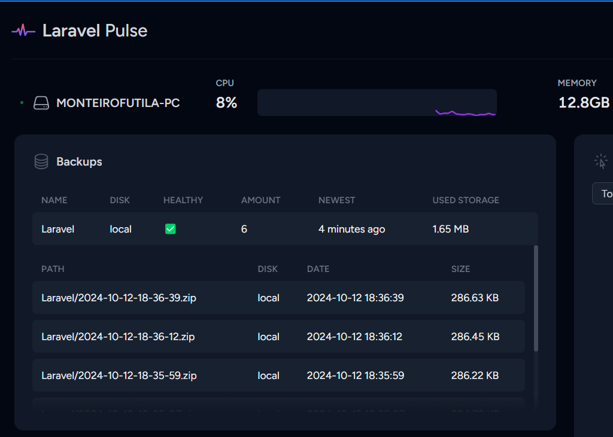

# Laravel Backup Pulse

[](https://packagist.org/packages/monteirofutila/laravel-backup-pulse)
[](https://github.com/monteirofutila/laravel-backup-pulse/actions?query=workflow%3Arun-tests+branch%3Amain)
[](https://github.com/monteirofutila/plaravel-backup-pulse/actions?query=workflow%3A"Fix+PHP+code+style+issues"+branch%3Amain)
[](https://packagist.org/packages/monteirofutila/laravel-backup-pulse)

A Laravel Pulse card to monitor the health of the backups, and show an overview of all backups managed by the  [Laravel-Backup](https://spatie.be/docs/laravel-backup/) package.



## Installation

You can install the package via composer:

```bash
composer require monteirofutila/laravel-backup-pulse
```

Optionally, you can publish the views using

```bash
php artisan vendor:publish --tag="backup-pulse-views"
```

## Register the recorder

To run the checks you must add the PulseSpatieLaravelBackupRecorder to the pulse.php file.</p>

```diff
return [
    // ...
    
    'recorders' => [
+        \MonteiroFutila\LaravelBackupPulse\Recorders\LaravelBackupPulseRecorder::class => [],
    ]
]
```

You also need to be running the <a href="https://laravel.com/docs/10.x/pulse#dashboard-cards">pulse:check</a> command.

## Add to your dashboard

To add the card to the Pulse dashboard, you must first <a href="https://laravel.com/docs/10.x/pulse#dashboard-customization">publish the vendor view</a>

<p style="font-family: 'CustomFont';">Then, you can modify the dashboard.blade.php file: </p>

```diff
<x-pulse>

+    <livewire:backups cols='6' />

</x-pulse>
```

## Testing

```bash
composer test
```

## Changelog

Please see [CHANGELOG](CHANGELOG.md) for more information on what has changed recently.

## Contributing

Please see [CONTRIBUTING](CONTRIBUTING.md) for details.

## Security Vulnerabilities

Please review [our security policy](../../security/policy) on how to report security vulnerabilities.

## Credits

- [Monteiro Futila](https://github.com/monteirofutila)
- [All Contributors](../../contributors)

## License

The MIT License (MIT). Please see [License File](LICENSE.md) for more information.
